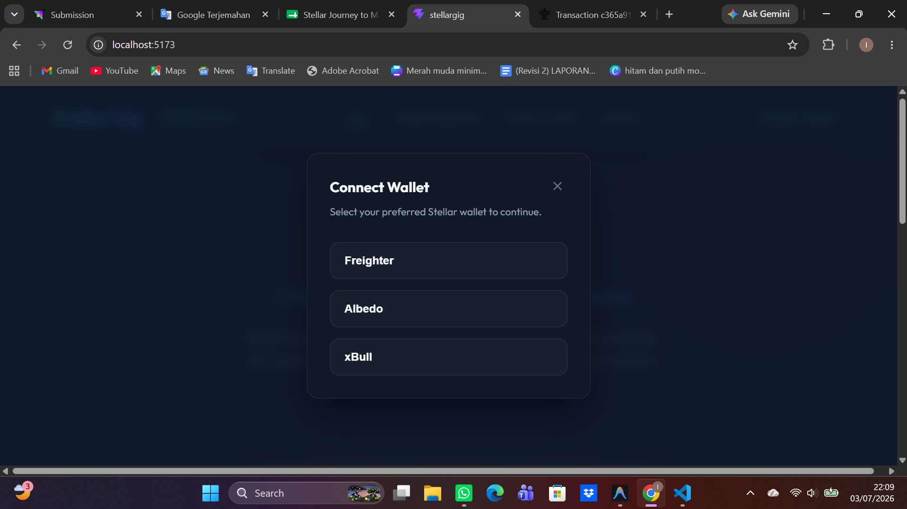
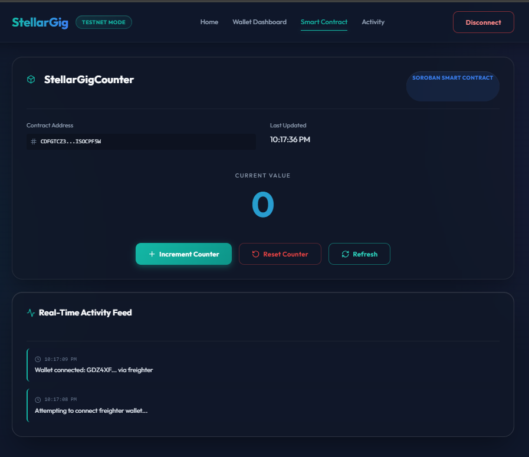
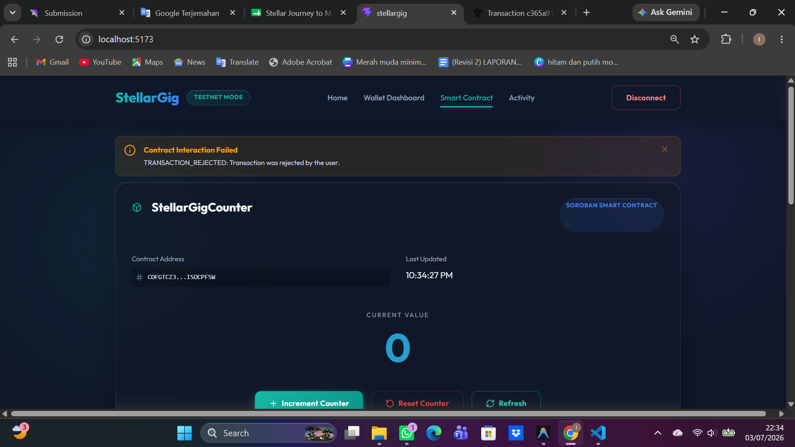

# StellarGig

**White Belt Stellar Payment dApp**

StellarGig is a cross-border escrow platform for freelancers. This application (Level 2 Yellow Belt) demonstrates Multi-Wallet connection, Soroban Smart Contract integration, Real-Time Event Listening, and comprehensive Error Handling on the Stellar Testnet.

## Level 2 Features
- **Multi-Wallet Integration**: Support for Freighter, Albedo, and xBull using `StellarWalletsKit`.
- **Soroban Smart Contract**: A custom Counter contract built in Rust and deployed to the Stellar Testnet.
- **Contract Dashboard**: Frontend integration to Read (get_count) and Write (increment, reset) to the Soroban contract.
- **Real-Time Events**: Activity Feed that polls the blockchain to show real-time transactions and events.
- **Robust Error Handling**: Graceful degradation and modern Alert components for user rejections, unfunded accounts, and missing extensions.

## Tech Stack
- React.js 18 + Vite
- Vanilla CSS (Modern Fintech UI - Tailwind-inspired)
- `@creit.tech/stellar-wallets-kit` (Multi-Wallet)
- `@stellar/stellar-sdk` (Soroban RPC integration)
- Rust + Soroban CLI (Smart Contracts)

## Deployed Contract Information
- **Contract Name**: StellarGigCounter
- **Contract Address**: `CDFGTCZ3UGEADUXGVVPCAWFCCI3B3LUB44AXX5OHF6MXEO2DISOCPF5W`
- **Contract Call Hash**: `ceae36c6bc6f54ac8f85ba037d1188d68022f66d5ed2c9603496eaf766ed782c`

## Live Demo
[Insert Vercel Deployment URL Here]

## Level 2 Screenshots

### 1. Multi Wallet Selection
*(Screenshot showing the Wallet Selection Modal with Freighter, Albedo, and xBull)*


### 2. Contract Dashboard & Real-Time Feed
*(Screenshot showing the Contract Dashboard, Current Counter Value, and the Activity Feed on the left)*


### 3. Error Handling
*(Screenshot showing an Alert Card when a user rejects a transaction or doesn't have a wallet installed)*


## How to Install

1. Clone the repository:
```bash
git clone https://github.com/izath-phb/stellargig.git
cd stellargig
```

2. Install dependencies:
```bash
npm install
```

## How to Run Locally

Start the Vite development server:
```bash
npm run dev
```
Then, open the provided localhost URL in your browser.

## How to Use

1. Ensure you have the [Freighter Wallet extension](https://www.freighter.app/) installed in your browser.
2. Switch your Freighter Wallet to the **Testnet** network and ensure it has a balance (you can fund it via the Freighter UI or [Stellar Laboratory](https://laboratory.stellar.org/#account-creator?network=test)).
3. Click "Connect Wallet" on the StellarGig web interface.
4. View your Public Key and XLM balance.
5. In the "Send XLM" section, enter a valid Testnet destination public key and the amount of XLM to send.
6. Click "Send XLM" and approve the transaction in the Freighter popup.
7. Wait for the transaction result. If successful, you can click the link to view it on Stellar Expert!

---

