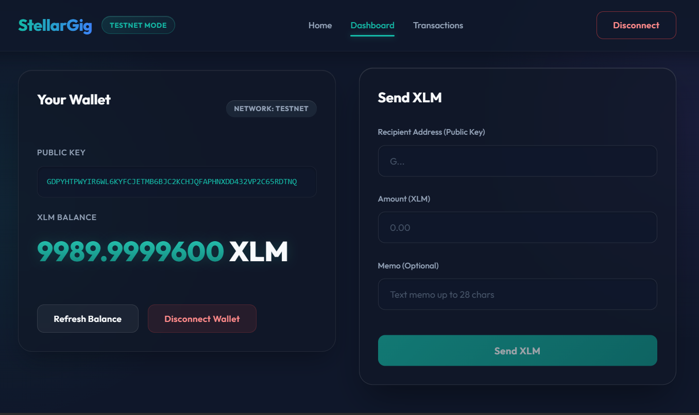
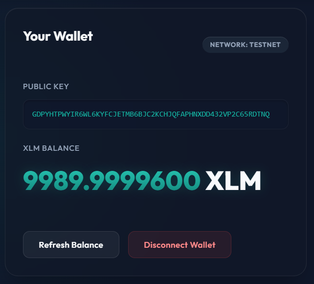
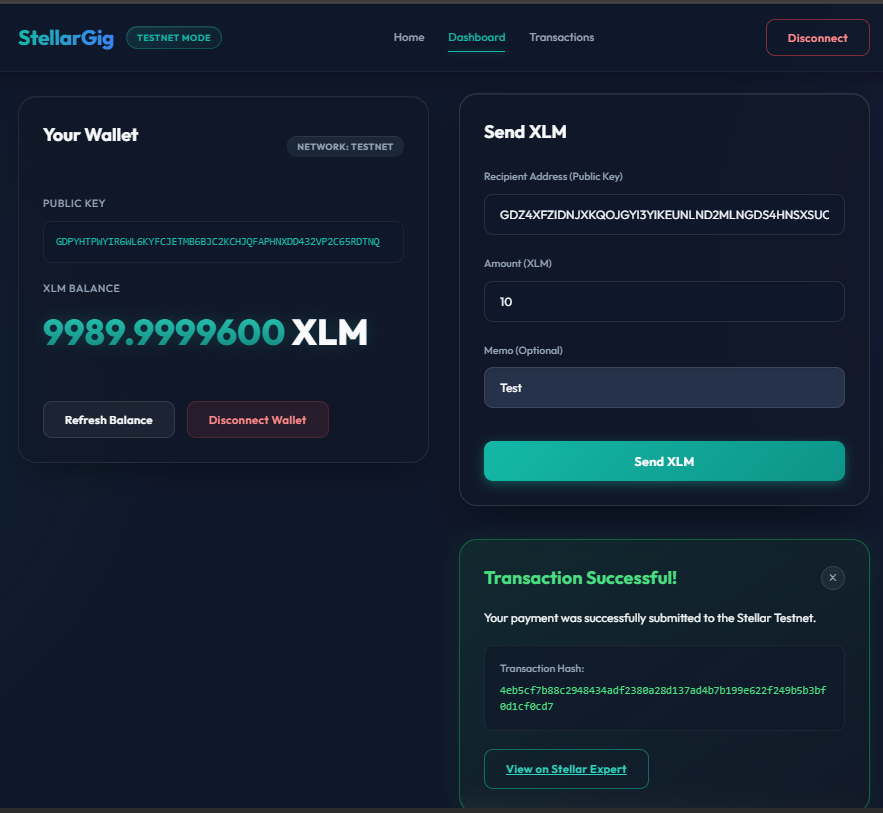

# StellarGig

**White Belt Stellar Payment dApp**

StellarGig Level 1 is a simple testnet application for connecting Freighter Wallet, checking XLM balances, and sending XLM transactions on the Stellar Testnet. This is built as the foundation for a cross-border payment starter dApp for freelancers.

## Features
- Connect and disconnect Freighter Wallet
- Display public key and current XLM balance
- Send XLM transactions on Stellar Testnet
- Real-time transaction success/failure feedback
- Direct links to Stellar Expert Testnet Explorer for transaction verification

## Tech Stack
- React.js 18
- Vite
- Vanilla CSS (Custom modern fintech UI)
- @stellar/freighter-api
- @stellar/stellar-sdk

## Screenshots

Here are the visual proofs of the working application required for the submission:

### 1. Wallet Connected State
*(Take a screenshot of the dashboard showing the connected wallet interface)*


### 2. Balance Displayed
*(Take a screenshot clearly showing the XLM Balance number on the screen)*


### 3. Successful Testnet Transaction & Result Shown
*(Take a screenshot after sending XLM where the green success alert and Transaction Hash are visible to the user)*


## How to Install

1. Clone the repository:
```bash
git clone https://github.com/your-username/stellargig.git
cd stellargig
```

2. Install dependencies:
```bash
npm install
```

## How to Run Locally

Start the Vite development server:
```bash
npm run dev
```
Then, open the provided localhost URL in your browser.

## How to Use

1. Ensure you have the [Freighter Wallet extension](https://www.freighter.app/) installed in your browser.
2. Switch your Freighter Wallet to the **Testnet** network and ensure it has a balance (you can fund it via the Freighter UI or [Stellar Laboratory](https://laboratory.stellar.org/#account-creator?network=test)).
3. Click "Connect Wallet" on the StellarGig web interface.
4. View your Public Key and XLM balance.
5. In the "Send XLM" section, enter a valid Testnet destination public key and the amount of XLM to send.
6. Click "Send XLM" and approve the transaction in the Freighter popup.
7. Wait for the transaction result. If successful, you can click the link to view it on Stellar Expert!

---

